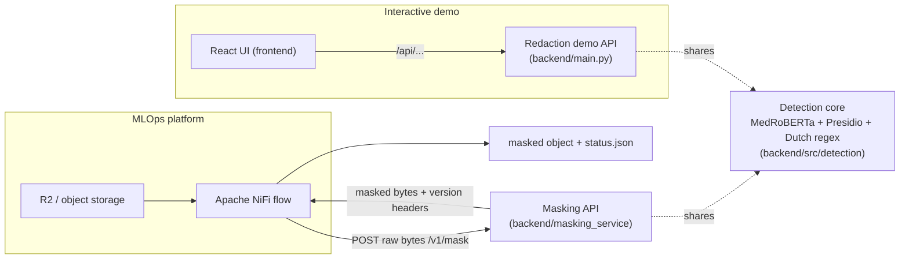

# End-to-End PII v2 — Dutch Clinical PII Masking

An end-to-end system for detecting and masking **PII/PHI in Dutch clinical text**,
built around a fine-tuned **MedRoBERTa + regex** detector. It ships as a
**contract-compliant masking API** (for MLOps / Apache NiFi integration) and a
**React demo UI**, sharing one detection core.

- **Detection core:** [`ziadosama/pii-medroberta-nl`](https://huggingface.co/ziadosama/pii-medroberta-nl)
  (fine-tuned Dutch MedRoBERTa token-classifier) + Presidio + Dutch/Belgian regex
  recognizers (INSZ, RIZIV, IBAN, phone, …).
- **Integration contract:** [PII Masking API Contract v1.2](docs/PII_Masking_API_Contract_v1.2.md).
- **Formats today:** `text/plain`, `text/csv`, `application/json`. *(PDF is on the
  roadmap — see [Contract compliance](#contract-compliance).)*

---

## Table of contents

- [What's in the box](#whats-in-the-box)
- [Architecture](#architecture)
- [Repository layout](#repository-layout)
- [The detection core: MedRoBERTa + regex](#the-detection-core-medroberta--regex)
- [Quickstart](#quickstart)
- [Configuration](#configuration)
- [API reference](#api-reference)
- [Testing & quality](#testing--quality)
- [MLflow packaging](#mlflow-packaging)
- [CI/CD & release](#cicd--release)
- [Contract compliance](#contract-compliance)
- [Documentation](#documentation)

---

## What's in the box

This repository contains **three deployables** that share the same detection core:

| Component | Path | What it is |
|---|---|---|
| **Masking API** (the MLOps deliverable) | [`backend/masking_service/`](backend/masking_service) | A stateless FastAPI service implementing **contract v1.2** (`/health`, `/ready`, `/version`, `POST /v1/mask`). NiFi calls it with raw file bytes and gets masked bytes back. |
| **Redaction demo API** | [`backend/main.py`](backend/main.py) | A small FastAPI app (`MedRoBERTa PII Redaction API`) exposing `/api/...` for the React UI. |
| **Frontend** | [`frontend/`](frontend) | A React 19 + Vite + TypeScript UI that talks to the demo API. |

> **Masking API vs. demo API** — the **masking API** is the production,
> contract-governed boundary that MLOps/NiFi integrates with. The **demo API**
> is a convenience app for interactive testing in the browser. Both reuse
> [`backend/src/detection`](backend/src/detection).

---

## Architecture



The masking API never reads or writes object storage — **NiFi owns object
movement**; the service only masks the bytes it is handed. Every masked response
carries immutable release-identity headers (`X-Service-Release`, `X-Git-SHA`,
`X-Image-Digest`, `X-Model-Name`, `X-Model-Version`, `X-Model-Digest`) that match
`GET /version`, so the deployed release can never disagree with what it reports.

---

## Repository layout

```text
.
├── Dockerfile                     Multi-stage image: `model` (production) / `api` (light)
├── docker-compose.yml             Locked-down internal network, no host port, model mount
├── .dockerignore
├── .env.example                   Every runtime setting, documented
├── requirements-api.txt           Masking API runtime (regex fallback needs only these)
├── requirements-dev.txt           Lint / test / audit tooling
├── pyproject.toml                 ruff · black · pytest · coverage config
├── .pre-commit-config.yaml        ruff · black · gitleaks · hygiene hooks
├── .gitlab-ci.yml                 lint → security → test → build-image
├── conftest.py                    Puts backend/ on sys.path; seeds test env
├── postman/                       Ready-to-run request collection for the 4 endpoints
├── shell/                         lint.sh · format.sh · contract_test.sh
├── docs/                          Architecture + the API contract
├── backend/
│   ├── main.py                    Demo "MedRoBERTa PII Redaction API" for the UI
│   ├── requirements.txt           Full detector/model stack (torch, transformers, presidio, spaCy…)
│   ├── masking_service/           ⭐ The contract v1.2 masking API
│   │   ├── app.py                 Endpoints + contract error/response shaping
│   │   ├── config.py              Settings + immutable release identity
│   │   ├── masking_core.py        Structure-preserving maskers (TXT/CSV/JSON) + regex fallback
│   │   ├── medroberta_masker.py   The MedRoBERTa + regex core, wrapped as a Masker
│   │   ├── mlflow_medroberta.py   MLflow pyfunc packaging of the MedRoBERTa model
│   │   ├── mlflow_model.py        MLflow packaging of a generic masker
│   │   └── tests/                 Contract acceptance tests
│   ├── src/detection/             MedRoBERTa recognizer + Dutch regex + Presidio wiring
│   ├── src/ingestion/             Demo API router
│   └── scripts/                   Data prep / synthetic generation
├── data/                          Synthetic Dutch reports (no real PII)
└── frontend/                      React + Vite + TypeScript UI
```

---

## The detection core: MedRoBERTa + regex

Detection is done by a single Presidio `AnalyzerEngine` that runs **two
recognizers together** on every request
([`backend/src/detection/pii_detector.py`](backend/src/detection/pii_detector.py)):

1. **`MedRobertaPIIRecognizer`** — the fine-tuned `ziadosama/pii-medroberta-nl`
   token-classifier (primary detector for names, addresses, identifiers in prose).
2. **Dutch/Belgian regex recognizers** — exact structured identifiers (INSZ,
   RIZIV, IBAN, phone, …) from [`dutch_regex.py`](backend/src/detection/dutch_regex.py).

Clinical content (e.g. `MEDICATION`, `CLINICAL_NOTE`) is kept **visible**; only
identifying entities are replaced with labelled placeholders like `<PATIENT_NAME>`.

The masking API can load this core in three ways (chosen by env — see
[Configuration](#configuration)):

| Mode | `MASKING_MODEL_VERSION` / `MODEL_URI` | Needs the model stack? | Use for |
|---|---|---|---|
| **MedRoBERTa + regex** (production) | `medroberta-nl-1` | ✅ yes | real deployments |
| **MLflow-packaged** | `MODEL_URI=models:/pii-medroberta-nl/<n>` | ✅ yes | registry-pinned deployments |
| **Regex-only fallback** | `regex-poc-1` (code default) | ❌ no | CI / quick smoke tests |

> The `regex-poc-1` fallback exists **only** so tests and a bare install can boot
> without the multi-GB AI stack. It never changes production behavior — production
> always uses MedRoBERTa + regex.

---

## Quickstart

### Prerequisites

- Python 3.12
- Node.js 20+ (only for the frontend)
- Docker (optional, for the container path)

### Option A — Masking API in Docker (production shape)

The production image bundles the MedRoBERTa stack. On an isolated network the
container cannot reach the Hub, so mount the weights locally.

```bash
# 1. Configure
cp .env.example .env
# edit .env: set SERVICE_TOKEN, and put the MedRoBERTa weights under ./models/medroberta

# 2. Build the production (model) image and run it
docker build --target model -t pii-masking-api:1.0.0-model .
docker compose up
```

Light, dependency-free variant (regex fallback, for a quick smoke test):

```bash
docker build --target api -t pii-masking-api:1.0.0 .
# then set MASKING_MODEL_VERSION=regex-poc-1 in .env
```

### Option B — Masking API locally

```bash
python -m venv .venv && source .venv/Scripts/activate   # Windows Git Bash
pip install -r requirements-api.txt          # API runtime
pip install -r backend/requirements.txt      # MedRoBERTa/detector stack (for medroberta-nl-1)
python -m spacy download nl_core_news_sm

cp .env.example .env                          # set SERVICE_TOKEN
cd backend
uvicorn masking_service.app:app --port 8000
```

Then verify the contract end-to-end:

```bash
BASE_URL=http://localhost:8000 SERVICE_TOKEN=<your-token> bash shell/contract_test.sh
```

### Option C — Full demo (redaction API + React UI)

```bash
start_chatbot.bat
```

This launches the demo API (`backend/main.py`, port 8000) and the React dev
server, then open <http://localhost:5173>.

---

## Configuration

All settings are environment variables; copy [`.env.example`](.env.example) to
`.env` (git-ignored) and fill it in. The most important ones:

| Variable | Purpose |
|---|---|
| `SERVICE_TOKEN` | Bearer token every `POST /v1/mask` must present. **Required.** |
| `MASKING_MODEL_VERSION` | `medroberta-nl-1` (production) or `regex-poc-1` (fallback). |
| `MODEL_URI` | Optional: load an MLflow-packaged model instead, e.g. `models:/pii-medroberta-nl/17`. |
| `HF_MODEL_REPO` / `PII_MODEL_DIR` | Where MedRoBERTa weights come from (Hub repo, or a local dir for offline/isolated networks). |
| `SERVICE_RELEASE`, `GIT_SHA`, `IMAGE_DIGEST`, `MODEL_VERSION`, `MODEL_DIGEST` | Immutable release identity reported on `/version` and every masked response. Moving labels (`latest`, `champion`) are refused; unset values report `unknown`. |
| `MAX_UPLOAD_SIZE_BYTES` | Transport limit (default 10 MiB). Larger bodies get `413`. |
| `MAX_CONCURRENT_MASKS` | Concurrency bound; over-limit requests get `429` + `Retry-After`. |

---

## API reference

| Method | Path | Auth | Purpose |
|---|---|---|---|
| `GET` | `/health` | none | Liveness — the process answers. |
| `GET` | `/ready` | none | Readiness — model loaded (`503` until then). |
| `GET` | `/version` | none | Exact API, code, image, and model identity now loaded. |
| `POST` | `/v1/mask` | Bearer | Mask one file; returns masked **raw bytes** + version headers. |
| `GET` | `/healthz` | none | Retained legacy liveness/readiness probe. |

Example masking request (raw bytes in the body — not JSON, not multipart):

```bash
curl --fail-with-body \
  --request POST \
  --header "Authorization: Bearer ${SERVICE_TOKEN}" \
  --header "Content-Type: text/plain" \
  --header "X-Request-ID: 041ce3f5-6a98-5272-b8c3-f5e3864b2b71" \
  --header "X-Team-ID: team-1" \
  --data-binary "Patient jan.jansen@example.com, IBAN BE68539007547034." \
  --dump-header - \
  "http://localhost:8000/v1/mask"
```

Errors use the contract's sanitized body (no input, no PII, no stack traces):

```json
{ "error": { "code": "UNSUPPORTED_MEDIA_TYPE", "message": "...", "retryable": false, "request_id": "..." } }
```

A ready-to-run [Postman collection](postman/masking-api-v1.postman_collection.json)
covers all four endpoints plus the 401/415 cases.

---

## Testing & quality

```bash
pip install -r requirements-api.txt -r requirements-dev.txt

# Contract acceptance tests (run from the repo root; conftest wires up paths)
pytest

# Format & lint (same scripts CI runs)
bash shell/format.sh     # apply fixes
bash shell/lint.sh       # check only
```

Tests run against the dependency-free `regex-poc-1` masker so they need no GPU,
torch, or model download. Install [pre-commit](.pre-commit-config.yaml) to catch
issues before they reach CI:

```bash
pip install pre-commit && pre-commit install
```

---

## MLflow packaging

The MedRoBERTa masker can be packaged as an `mlflow.pyfunc` model and registered,
so deployments resolve an **immutable numeric model version**
([`mlflow_medroberta.py`](backend/masking_service/mlflow_medroberta.py)):

```bash
python -m masking_service.mlflow_medroberta   # logs + registers the model
```

Then deploy with `MODEL_URI=models:/pii-medroberta-nl/<version>` and set
`MODEL_VERSION`/`MODEL_DIGEST` in `.env` so `/version` reports the exact artifact.

---

## CI/CD & release

[`.gitlab-ci.yml`](.gitlab-ci.yml) runs four stages: **lint → security
(SAST + secret detection + `pip-audit`) → test → build-image**. The build stamps
`SERVICE_RELEASE` and `GIT_SHA` into an immutable image and records the pushed
digest, matching contract v1.2 §10. Production deployments pin the image by
**digest**, never `latest`.

---

## Contract compliance

Against the [v1.2 acceptance checklist](docs/PII_Masking_API_Contract_v1.2.md#11-acceptance-checklist-for-every-team):

- ✅ `/health`, `/ready`, `/version` comply.
- ✅ `/v1/mask` accepts raw bytes; echoes `X-Request-ID`; returns all version headers.
- ✅ `415` unsupported media · `413` oversized · `422` malformed · `401` bad token · `429`/`503` with `Retry-After`.
- ✅ No source content, PII, tokens, or stack traces in logs or error bodies.
- ⚠️ **PDF not yet supported.** The contract's canary format is `application/pdf`;
  this service currently masks `text/plain`, `text/csv`, `application/json`.
  `/version` honestly reports only the formats it can process. Adding PDF means
  wiring PyMuPDF text extraction into `masking_core` and adding `application/pdf`
  to `supported_media_types`.

---

## Documentation

- [Architecture](docs/architecture.md) — layout and request flow.
- [PII Masking API Contract v1.2](docs/PII_Masking_API_Contract_v1.2.md) — the integration contract.
- [Masking service README](backend/masking_service/README.md) — service-level notes.
