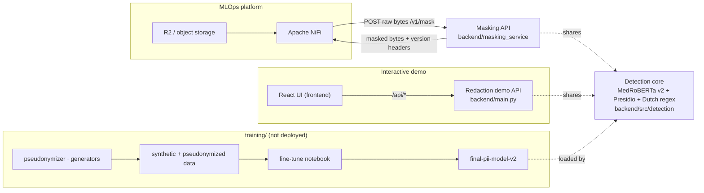

# End-to-End PII v2 — Dutch Clinical PII Masking

A production-oriented system for detecting and masking **PII/PHI in Dutch clinical
documents**, built around a fine-tuned **MedRoBERTa + regex** detector and a
**contract-compliant HTTP masking API** for MLOps / Apache NiFi integration.

| | |
|---|---|
| **Detection model** | [`ziadosama/final-pii-model-v2`](https://huggingface.co/ziadosama/final-pii-model-v2) — fine-tuned `MedRoBERTa.nl` token-classifier (13-label v2 taxonomy) |
| **Also uses** | Presidio + Dutch/Belgian regex (INSZ, RIZIV, BTW, phone, IBAN, …) |
| **Integration contract** | [PII Masking API Contract v1.2](docs/PII_Masking_API_Contract_v1.2.md) |
| **Input formats** | `text/plain`, `text/csv`, `application/json`, `application/pdf` |
| **De-identification policy** | **Precise** — removes identifiers, preserves clinical content |

---

## Table of contents

- [What it does](#what-it-does)
- [Architecture](#architecture)
- [Repository layout](#repository-layout)
- [The detection model](#the-detection-model)
- [API](#api)
- [Quickstart](#quickstart)
- [Evaluation](#evaluation)
- [Training & data pipeline](#training--data-pipeline)
- [Testing & quality](#testing--quality)
- [Security](#security)
- [Documentation index](#documentation-index)

---

## What it does

Given a Dutch clinical document, the system removes information that **identifies a
person** — patient and doctor names, national numbers (INSZ), provider numbers
(RIZIV), addresses, phones, dates, URLs, e-mails — while **keeping the medical
content intact** (diagnoses, medications, lab values, disease eponyms). The masked
output is returned in the same format as the input; for PDFs it is a valid PDF with
the original layout preserved and only the PII regions redacted.

---

## Architecture

Three deployables share one detection core:

| Component | Path | Role | Port |
|---|---|---|---|
| **Masking API** | [`backend/masking_service/`](backend/masking_service) | Contract v1.2 service NiFi calls (`/health`, `/ready`, `/version`, `POST /v1/mask`) | 8000 |
| **Redaction demo API** | [`backend/main.py`](backend/main.py) | Convenience API for the browser UI (`/api/chat`, `/api/upload`) | 8000 |
| **Frontend** | [`frontend/`](frontend) | React + Vite UI (chat + file upload, downloads masked PDFs) | 5173 |



The masking API never reads or writes object storage — NiFi moves the source and
destination objects. Every masked response carries immutable release-identity headers
(`X-Service-Release`, `X-Git-SHA`, `X-Image-Digest`, `X-Model-Name`, `X-Model-Version`,
`X-Model-Digest`) that match `GET /version`.

---

## Repository layout

```text
End-to-End-PII-v2/
├── backend/
│   ├── main.py                     Redaction demo API (serves the UI)
│   ├── requirements.txt            Full model/detector stack
│   ├── masking_service/            ⭐ Contract v1.2 masking API
│   │   ├── app.py                  Endpoints, contract headers & error bodies
│   │   ├── config.py               Settings + immutable release identity
│   │   ├── masking_core.py         Structure-preserving TXT/CSV/JSON masking + regex fallback
│   │   ├── pdf_masking.py          PDF redaction (PyMuPDF) + scanned-page OCR
│   │   ├── medroberta_masker.py    MedRoBERTa v2 + regex core, wrapped as a Masker
│   │   ├── mlflow_medroberta.py    MLflow packaging of the model
│   │   ├── evaluate_precise.py     Dataset-agnostic precision/recall/F1 evaluator
│   │   └── tests/                  Contract acceptance tests
│   ├── src/detection/              Presidio wiring: MedRoBERTa recognizer + Dutch regex + resolver
│   └── scripts/                    Data prep / clinical-negative augmentation
├── frontend/                       React + Vite + TypeScript UI
├── training/                       Data pipeline, datasets & fine-tune notebook (see training/README.md)
│                                   — not needed to run the service; excluded from Docker
├── docs/                           Architecture + the API contract
├── postman/                        Ready-to-run request collection
├── shell/                          lint.sh · format.sh · contract_test.sh
├── Dockerfile  docker-compose.yml  .dockerignore
├── requirements-api.txt  requirements-dev.txt  pyproject.toml
├── .gitlab-ci.yml  .pre-commit-config.yaml  conftest.py
├── README.md  SETUP.md  HANDOFF.md
└── start_chatbot.bat               One-click local demo (backend + frontend)
```

---

## The detection model

### v2 taxonomy (13 labels)

| Group | Labels |
|---|---|
| Trained (NER) | `NAME`, `DATE`, `ORGANIZATION`, `CITY`, `ZIP_CODE`, `STREET`, `BUILDING_NUMBER`, `AGE`, `PHONE` |
| Structured (regex, verified) | `INSZ`, `RIZIV`, `BTW_EENHEID`, `EMAIL`, `URL`, `IBAN` |
| Derived | `GENDER` (computed from the INSZ, not string-matched) |

The MedRoBERTa recognizer reads its labels straight from the model config, so the
service adapts automatically to whatever version is deployed.

### Precise de-identification

The system follows a **precise** policy: it removes real identifiers and **preserves
medical terminology** — disease eponyms (*Von Willebrand*), medications, and lab units
are **not** masked. This keeps the de-identified output medically useful and avoids
false positives on clinical text. (An aggressive "mask anything name-shaped" mode is
available in the training pipeline via `PSEUDONYMIZE_FREETEXT`.)

### Overlap resolution (coverage-preserving)

When the model and the regex both fire on one value, `resolve_overlaps`
([`pii_detector.py`](backend/src/detection/pii_detector.py)) keeps the most specific
label (e.g. `INSZ` over `PHONE`) but **never drops coverage** — it only removes fully
redundant spans, so precision improves while recall can never fall.

---

## API

| Method | Path | Auth | Purpose |
|---|---|---|---|
| `POST` | `/v1/mask` | Bearer | Mask one file (raw bytes in, masked bytes out) |
| `GET` | `/health` | none | Liveness |
| `GET` | `/ready` | none | Readiness (`503` until the model is loaded) |
| `GET` | `/version` | none | Exact deployed API/code/image/model identity |

```bash
curl --fail-with-body -X POST \
  -H "Authorization: Bearer ${SERVICE_TOKEN}" \
  -H "Content-Type: application/pdf" \
  -H "X-Request-ID: 041ce3f5-6a98-5272-b8c3-f5e3864b2b71" \
  -H "X-Team-ID: team-1" \
  --data-binary @input.pdf \
  --dump-header headers.txt --output masked.pdf \
  https://<host>/v1/mask
```

Errors use the contract's sanitized body — no input, PII, or stack traces:
`{"error":{"code":"...","message":"...","retryable":false,"request_id":"..."}}`.
Full spec: [docs/PII_Masking_API_Contract_v1.2.md](docs/PII_Masking_API_Contract_v1.2.md).
For deployment/handoff details see [HANDOFF.md](HANDOFF.md).

---

## Quickstart

> First time here? Follow **[SETUP.md](SETUP.md)** for the full, step-by-step setup
> (prerequisites, model weights, environment).

```bash
# Masking API in Docker (production image bundles MedRoBERTa + OCR)
cp .env.example .env                # set SERVICE_TOKEN
docker build --target model -t pii-masking-api:1.0.0-model .
docker compose up

# — or the interactive demo (backend + React UI) —
start_chatbot.bat                   # then open http://localhost:5173
```

---

## Evaluation

A dataset-agnostic evaluator runs the exact production pipeline and reports real
per-label precision / recall / F1, deriving clean ground truth from the pipeline's
own replacement report (no hand-labelling):

```bash
cd backend
python -m masking_service.evaluate_precise \
    --docs   ../training/data/pseudonymized \
    --report ../training/docs/phase_4_pseudonymization_report.md
```

**Latest result (pseudonymized set, precise policy):** overall **P 0.977 · R 0.977 ·
F1 0.977**, with `INSZ`, `RIZIV`, `URL` at 1.0 and every other label ≥ 0.94.

---

## Training & data pipeline

Everything needed to regenerate the data and re-train the model lives under
[`training/`](training/README.md): the pseudonymizer, synthetic-data generators,
datasets (including clinical-table negatives), and the Kaggle/Colab fine-tune
notebook. It is **not** required to run the service and is excluded from the Docker
image. See [training/README.md](training/README.md).

---

## Testing & quality

```bash
pip install -r requirements-api.txt -r requirements-dev.txt
pytest                     # contract acceptance tests (light, no GPU)
bash shell/lint.sh         # ruff + black (same as CI)
```

CI ([`.gitlab-ci.yml`](.gitlab-ci.yml)) runs lint → security (SAST + secret scan +
`pip-audit`) → tests → immutable image build.

---

## Security

- The service requires a bearer `SERVICE_TOKEN`; secrets are injected at runtime,
  never committed, and never logged. Request/response bodies are not logged.
- `training/config.py` reads any API keys from environment variables — do not
  hard-code credentials.
- Synthetic and pseudonymized data only; no real patient data in the repo.

---

## Documentation index

| Document | Covers |
|---|---|
| [SETUP.md](SETUP.md) | Clone & run everything, step by step |
| [HANDOFF.md](HANDOFF.md) | What to give the MLOps/NiFi team to deploy |
| [docs/architecture.md](docs/architecture.md) | Service internals & request flow |
| [docs/PII_Masking_API_Contract_v1.2.md](docs/PII_Masking_API_Contract_v1.2.md) | The integration contract |
| [backend/README.md](backend/README.md) | Backend (both APIs + detection core) |
| [backend/masking_service/README.md](backend/masking_service/README.md) | Masking service internals |
| [training/README.md](training/README.md) | Data pipeline & fine-tuning |
