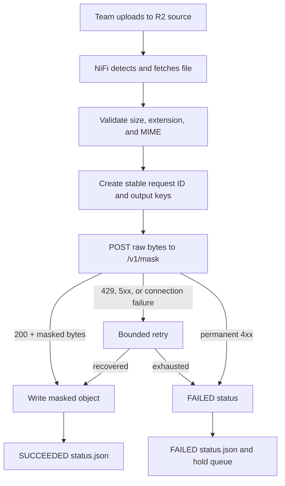

# PII Masking API Contract v1.2

**Status:** Required integration contract  
**Contract version:** 1.2  
**Applies to:** Team 1 and every later AI/model team integrated with the MLOps NiFi flow  
**Transport:** HTTPS  
**Processing style:** Synchronous, one file per request

## 1. Purpose and responsibility boundary

This contract defines how NiFi calls each team's masking service, how the service reports the exact API/model release that processed a file, and how errors are classified for retry or permanent failure.

The responsibilities are separated as follows:

| Component/team | Responsibility |
|---|---|
| Uploading team | Upload the source file to its permitted R2 source prefix. |
| NiFi/MLOps | Detect, fetch, validate, identify, call the API, retry transient failures, write the masked output, and write the status manifest. |
| AI/model team | Mask the received file and return the masked file while complying with this HTTP contract. |
| GitLab CI/CD | Test and publish an immutable versioned service image. |
| MLflow | Store model-development/evaluation lineage and, when used, the registered model version. |

The masking API must **not** read from or write to R2. It therefore receives no R2 credentials. NiFi is the only component that moves the source and destination objects.

## 2. Endpoints

Every team service must expose these endpoints under one stable HTTPS host:

| Method | Path | Purpose | Required response |
|---|---|---|---|
| `GET` | `/health` | Liveness: the web service process is alive. | `200` with small JSON. |
| `GET` | `/ready` | Readiness: the model and required runtime resources are loaded. | `200` when ready; `503` otherwise. |
| `GET` | `/version` | Exact deployed API, code, image, and model identity. | `200` with the schema below. |
| `POST` | `/v1/mask` | Mask exactly one file. | `200` with masked file bytes, or a defined error. |

Example `/health` response:

```json
{
  "status": "UP"
}
```

Example `/ready` response:

```json
{
  "status": "READY",
  "model_loaded": true
}
```

Example `/version` response:

```json
{
  "service": "team-1-pii-masker",
  "api_contract_version": "v1",
  "service_release": "1.3.0",
  "git_sha": "71ac34f7b57b49fa89c98a1580c141ce0cbedc8d",
  "image_digest": "sha256:1111111111111111111111111111111111111111111111111111111111111111",
  "model_name": "team-1-pii-masker",
  "model_version": "17",
  "model_digest": "sha256:2222222222222222222222222222222222222222222222222222222222222222",
  "supported_mime_types": [
    "application/pdf",
    "text/plain",
    "text/csv",
    "application/json"
  ],
  "max_file_bytes": 10485760
}
```

Rules:

- Values must describe what is **actually loaded**, not merely what was requested for deployment.
- `service_release` should use a unique release version such as semantic versioning.
- `git_sha`, `image_digest`, and `model_digest` must be immutable identifiers.
- `model_version` must be unique and resolvable to model lineage, such as an MLflow numeric model version or another immutable release version.
- Labels such as `latest`, `final`, or `fused-xlmr-final` are not sufficient by themselves.
- `supported_mime_types` must include only formats the deployed model can genuinely process and return correctly.

## 3. Mask request

### Request line

```http
POST /v1/mask HTTP/1.1
```

### Request body

The request body is the **raw file bytes**. It is not JSON and is not multipart form data.

This preserves the behavior of the current working NiFi flow: `InvokeHTTP` sends the FlowFile content directly as the body for a POST request.

### Required request headers

| Header | Example | Meaning |
|---|---|---|
| `Authorization` | `Bearer <service-token>` | Team-specific service credential. The token is stored as a sensitive MLOps parameter and never committed. |
| `Content-Type` | `application/pdf` | MIME type identified by NiFi. |
| `Accept` | `application/pdf` | Expected response file type. Usually the same as the input. |
| `X-Request-ID` | `041ce3f5-6a98-5272-b8c3-f5e3864b2b71` | Stable NiFi UUID5 request identity. |
| `Idempotency-Key` | `041ce3f5-6a98-5272-b8c3-f5e3864b2b71` | Same value on every retry of the same source object version. |
| `X-Team-ID` | `team-1` | Calling team/integration identity. |
| `X-Source-ETag` | `635ac6adc4cbca869a3f7af32fdb5175` | Source object version evidence. |

The API must treat repeated requests with the same `Idempotency-Key` as safe replays. It must not create duplicate external side effects. The service may recompute the masked output or return a securely cached result, but the externally visible result must remain consistent for the same deployed release.

### Current payload limits

- Maximum source size: **10 MiB (`10,485,760` bytes)**.
- The API must reject larger bodies with `413 Payload Too Large`.
- Team 1 must support `application/pdf` because PDF is the current verified canary format.
- A team may claim CSV, JSON, or text support only after those formats pass the same contract tests.
- Password-protected, corrupted, or otherwise unreadable documents must return `422`, not `200`.

## 4. Successful mask response

A successful request must return:

```http
HTTP/1.1 200 OK
Content-Type: application/pdf
X-Request-ID: 041ce3f5-6a98-5272-b8c3-f5e3864b2b71
X-API-Version: v1
X-Service-Release: 1.3.0
X-Git-SHA: 71ac34f7b57b49fa89c98a1580c141ce0cbedc8d
X-Image-Digest: sha256:1111111111111111111111111111111111111111111111111111111111111111
X-Model-Name: team-1-pii-masker
X-Model-Version: 17
X-Model-Digest: sha256:2222222222222222222222222222222222222222222222222222222222222222

<raw masked file bytes>
```

Success rules:

- Use `200` only when masking completed successfully.
- The response body must be the **non-empty masked file**, not a JSON wrapper, URL, Base64 string, or job identifier.
- The returned file must be valid and openable in its declared format.
- `Content-Type` must accurately describe the returned content.
- `X-Request-ID` must echo the request value.
- Every version header is mandatory and must match `/version` for the running instance.
- Do not return `200` with an error message or an unmasked original file.

For a successful `application/json` input, the response body is naturally masked JSON and `Content-Type` remains `application/json`; its `200` status distinguishes it from an error.

## 5. Error contract

Errors must use an appropriate non-2xx status and a small sanitized JSON body:

```json
{
  "error": {
    "code": "UNSUPPORTED_MEDIA_TYPE",
    "message": "The supplied media type is not supported by this release.",
    "retryable": false,
    "request_id": "041ce3f5-6a98-5272-b8c3-f5e3864b2b71"
  }
}
```

The error response must use:

```http
Content-Type: application/json
X-Request-ID: <echoed-request-id>
```

| HTTP status | Meaning | NiFi behavior |
|---:|---|---|
| `400` | Malformed request or missing required metadata. | Permanent failure; do not retry. |
| `401` | Missing or invalid service credential. | Permanent failure and alert; do not retry. |
| `403` | Caller is authenticated but not allowed. | Permanent failure and alert; do not retry. |
| `413` | File exceeds the contracted limit. | Permanent failure; do not retry. |
| `415` | Unsupported MIME type. | Permanent failure; do not retry. |
| `422` | File is corrupt, password-protected, unreadable, or cannot be masked safely. | Permanent failure; do not retry. |
| `429` | Service is temporarily rate-limited. | Retry up to three times; return `Retry-After` when possible. |
| `500` | Unexpected service/model error. | Retry up to three times. |
| `502` | Invalid upstream/runtime dependency response. | Retry up to three times. |
| `503` | Service/model is temporarily unavailable or not ready. | Retry up to three times; return `Retry-After` when possible. |
| `504` | Processing dependency timed out. | Retry up to three times. |

Socket timeouts and connection failures are also transient and are retried by NiFi up to three times. After the limit is exhausted, NiFi writes a `FAILED` manifest.

Error responses and logs must never include:

- Raw document content or extracted PII.
- Stack traces, local filesystem paths, secrets, access tokens, or internal connection strings.
- Full model prompts or intermediate text containing source content.

## 6. Runtime and security requirements

- All non-local traffic must use HTTPS.
- The API must require a dedicated service credential; human MLflow accounts must not be reused.
- Secrets must be injected at runtime and must not be stored in Git, container layers, logs, or `/version`.
- Request bodies and response bodies must not be logged.
- Recommended structured log fields are only: request ID, team ID, status, duration, byte count, service release, model version, and retry-safe error code.
- Do not log filenames because filenames can contain PII.
- The service must validate MIME type and file size independently even though NiFi validates them first.
- The service must bound memory, processing time, and concurrency.
- The pilot starts with one or two concurrent NiFi calls per team.
- The service should complete within the agreed NiFi socket-read timeout. The initial target is **120 seconds** for a file up to 10 MiB; a team must notify MLOps before requiring a longer limit.

## 7. Versioning and compatibility

The following versions are separate and must not be confused:

| Field | Changes when |
|---|---|
| `api_contract_version` | The request/response contract changes. |
| `service_release` | API code or dependencies change. |
| `model_version` | Weights, tokenizer, rules, prompts, or model configuration change. |
| `git_sha` | Source commit changes. |
| `image_digest` | Built container contents change. |
| `model_digest` | Exact deployed model artifact changes. |

Compatibility policy:

- Non-breaking API/model updates keep `POST /v1/mask` and publish new immutable release identifiers.
- Additive response metadata may be introduced within `v1` only when existing required behavior remains unchanged.
- Any breaking request or response change requires `/v2/mask` and a coordinated NiFi migration.
- Production deployments must be pinned to the immutable container image digest, never `latest`.
- If MLflow Model Registry is used, the service must report the resolved immutable numeric model version even when deployment selection uses a mutable alias such as `champion`.

## 8. End-to-end platform flow



Detailed flow:

1. The uploader writes a file under `source/incoming/<team>/requests/...` using its restricted upload credential.
2. `ListS3` detects a previously unseen object.
3. NiFi preserves the bucket, key, ETag, length, and timestamps.
4. NiFi builds an idempotency key from source bucket + source key + ETag.
5. NiFi derives a deterministic UUID5 request ID from that idempotency key.
6. NiFi builds the result and manifest keys:

   ```text
   masked/team=<team-id>/request=<request-id>/<original-filename>
   manifests/team=<team-id>/request=<request-id>/status.json
   ```

7. NiFi validates maximum size and allowed extension, fetches the object, identifies its actual MIME type, and validates the MIME type again.
8. NiFi calls the team's stable `/v1/mask` URL with raw bytes and request metadata headers.
9. The service returns the masked file and the exact deployed version headers.
10. NiFi writes the masked file to the destination bucket.
11. NiFi writes a durable `SUCCEEDED` manifest. For permanent or exhausted failures, it writes a `FAILED` manifest and retains the FlowFile for investigation.
12. NiFi provenance supports operational troubleshooting; MLflow remains responsible for controlled model experiments and evaluation rather than one run per production file.

## 9. Status manifest

Every successful file should produce a manifest similar to:

```json
{
  "status": "SUCCEEDED",
  "request_id": "041ce3f5-6a98-5272-b8c3-f5e3864b2b71",
  "team_id": "team-1",
  "source_key": "incoming/team-1/requests/HealthOne-NOVA3.pdf",
  "destination_key": "masked/team=team-1/request=041ce3f5-6a98-5272-b8c3-f5e3864b2b71/HealthOne-NOVA3.pdf",
  "source_etag": "635ac6adc4cbca869a3f7af32fdb5175",
  "api_contract_version": "v1",
  "service_release": "1.3.0",
  "git_sha": "71ac34f7b57b49fa89c98a1580c141ce0cbedc8d",
  "image_digest": "sha256:1111111111111111111111111111111111111111111111111111111111111111",
  "model_name": "team-1-pii-masker",
  "model_version": "17",
  "model_digest": "sha256:2222222222222222222222222222222222222222222222222222222222222222",
  "started_at": "2026-08-03T10:00:00.000Z",
  "completed_at": "2026-08-03T10:00:12.300Z",
  "api_retry_count": "0",
  "destination_retry_count": "0"
}
```

A failed manifest additionally records sanitized fields such as:

```json
{
  "status": "FAILED",
  "failure_stage": "MASKING_API",
  "failure_code": "API_HTTP_422",
  "http_status": "422",
  "error_class": "HTTP_RESPONSE",
  "error_message": "Masking API could not process the supplied document"
}
```

No manifest may contain source content or extracted PII.

## 10. Release and synchronization workflow

When a team changes API code or the model:

1. Open and review a GitLab merge request.
2. Run contract, model, security, and synthetic-file tests.
3. Build an immutable container image tagged with the service release and commit SHA.
4. Record and publish the resulting image digest, model version, and model digest.
5. Notify MLOps that a candidate release is ready; do not silently replace the production image.
6. MLOps pauses new NiFi ingestion and allows in-flight requests to drain.
7. MLOps deploys the exact image digest.
8. Verify `/health`, `/ready`, and `/version` against the requested release.
9. Process a synthetic canary PDF through the complete R2 → NiFi → API → destination flow.
10. Confirm that the masked file opens, expected synthetic PII is masked, and `status.json` contains the new release/model identifiers.
11. Resume ingestion. If validation fails, redeploy the previous known-good image digest.

NiFi continues calling the same stable `/v1/mask` URL for compatible updates. Only a breaking contract version requires a new NiFi URL or flow migration.

## 11. Acceptance checklist for every team

Before MLOps connects a team service, the team must demonstrate:

- [ ] `/health`, `/ready`, and `/version` comply with this contract.
- [ ] `/v1/mask` accepts raw bytes rather than multipart or JSON-wrapped files.
- [ ] PDF input returns a valid masked PDF with `200` and all version headers.
- [ ] The echoed `X-Request-ID` matches the request.
- [ ] The same idempotency key is safe to replay.
- [ ] Unsupported MIME returns `415`.
- [ ] Oversized input returns `413`.
- [ ] Corrupt or password-protected PDF returns `422`.
- [ ] Temporary overload returns `429` or `503`, preferably with `Retry-After`.
- [ ] No source content, PII, token, or stack trace is written to logs or error responses.
- [ ] The image is published by immutable digest and `/version` reports that exact digest.
- [ ] A synthetic end-to-end canary produces both the masked output and the versioned `status.json`.

## 12. Example contract test

```bash
curl --fail-with-body \
  --request POST \
  --header "Authorization: Bearer ${MASKING_API_TOKEN}" \
  --header "Content-Type: application/pdf" \
  --header "Accept: application/pdf" \
  --header "X-Request-ID: 041ce3f5-6a98-5272-b8c3-f5e3864b2b71" \
  --header "Idempotency-Key: 041ce3f5-6a98-5272-b8c3-f5e3864b2b71" \
  --header "X-Team-ID: team-1" \
  --data-binary @synthetic-canary.pdf \
  --dump-header response-headers.txt \
  --output masked-canary.pdf \
  "https://team1-api.example.internal/v1/mask"
```

Validation must confirm the HTTP status, required response headers, non-empty output, output MIME type, PDF validity, and expected masking against synthetic—not real customer—PII.

## References

- [Apache NiFi InvokeHTTP 2.10 documentation](https://nifi.apache.org/components/org.apache.nifi.processors.standard.InvokeHTTP/)
- [MLflow Model Registry documentation](https://mlflow.org/docs/latest/ml/model-registry)
- [GitLab immutable container tags](https://docs.gitlab.com/user/packages/container_registry/immutable_container_tags/)
