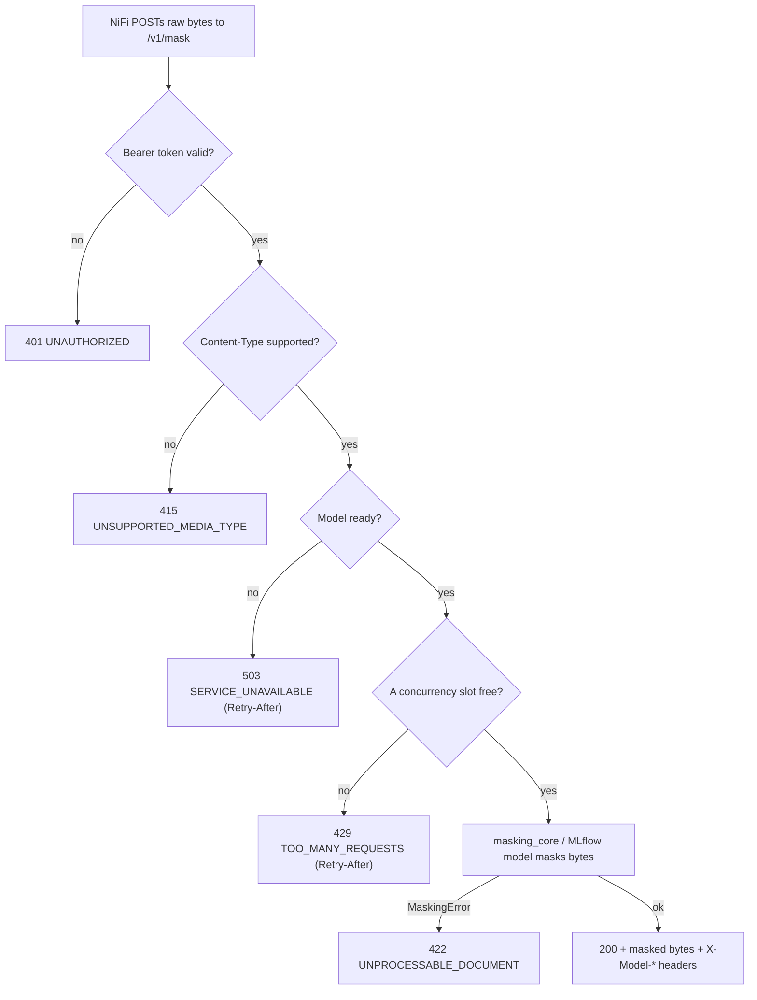

# Architecture

This service masks PII in one file per request and reports the exact release
that processed it, following [PII Masking API contract v1.2](PII_Masking_API_Contract_v1.2.md).
It never reads or writes object storage — NiFi moves the source and destination
objects and calls this service with raw bytes.

## Repository layout

```text
.
├── Dockerfile                     Multi-stage image (api / model targets)
├── docker-compose.yml             Locked-down internal network, no host port
├── .env.example                   Every runtime setting, documented
├── requirements-api.txt           API runtime (regex masker needs only these)
├── requirements-dev.txt           Lint, test, audit tooling
├── pyproject.toml                 ruff / black / pytest / coverage config
├── .pre-commit-config.yaml        ruff, black, gitleaks, hygiene hooks
├── .gitlab-ci.yml                 lint → security → test → build-image
├── conftest.py                    Puts backend/ on sys.path; seeds test env
├── postman/                       Ready-to-run request collection
├── shell/                         lint.sh, format.sh, contract_test.sh
├── docs/                          This file + the API contract
├── backend/
│   ├── masking_service/           The FastAPI service
│   │   ├── app.py                 Endpoints + contract error/response shaping
│   │   ├── config.py              Settings + immutable release identity
│   │   ├── masking_core.py        Deterministic, dependency-free maskers (TXT/CSV/JSON)
│   │   ├── pdf_masking.py         PDF redaction (PyMuPDF) + scanned-page OCR
│   │   ├── medroberta_masker.py   Optional fine-tuned Dutch detector
│   │   ├── mlflow_model.py        MLflow pyfunc packaging of a masker
│   │   └── tests/                 Contract acceptance tests
│   ├── src/detection/             Regex + transformer PII detection
│   └── scripts/                   Data prep / synthetic generation
├── data/                          Synthetic reports (no real PII)
└── frontend/                      UI (unchanged by this contract work)
```

## Endpoints

| Method | Path | Auth | Purpose |
|---|---|---|---|
| `GET` | `/health` | none | Liveness — the process answers. |
| `GET` | `/ready` | none | Readiness — the model is loaded (`503` until then). |
| `GET` | `/version` | none | The exact API, code, image, and model identity now loaded. |
| `POST` | `/v1/mask` | Bearer | Mask one file; returns masked bytes + version headers. |
| `GET` | `/healthz` | none | Retained legacy liveness/readiness probe. |

## Request flow



## Release identity

`config.load_settings()` reads the immutable identifiers a build and deployment
inject (`SERVICE_RELEASE`, `GIT_SHA`, `IMAGE_DIGEST`, `MODEL_VERSION`,
`MODEL_DIGEST`). A moving label such as `latest` or `champion` is refused; a
value left unset is reported as `unknown`. `config.release_identity()` is the
single source that fills both the `/version` body and the `X-*` headers on every
masked response, so the two can never disagree (contract v1.2 §4).

## Model loading

The model loads once at startup and is fixed for the process lifetime:

- **Production core — `MASKING_MODEL_VERSION=medroberta-nl-1`:** the fine-tuned
  Dutch clinical detector — Presidio + the `ziadosama/final-pii-model-v2`
  MedRoBERTa token-classifier + Dutch regex (`backend/src/detection`), wrapped as
  a `masking_core.Masker`. Requires the model stack in `backend/requirements.txt`.
  Weights come from `PII_MODEL_DIR` (a mounted local directory, required on an
  isolated network) or from `HF_MODEL_REPO` on the Hub.
- **MLflow-packaged — `MODEL_URI=models:/final-pii-model-v2/<n>` or `runs:/…`:**
  the same MedRoBERTa core packaged as an `mlflow.pyfunc` model
  (`mlflow_medroberta.py`), so deployment resolves an immutable registry version.
- **Fallback — `regex-poc-1` (code default):** the deterministic,
  dependency-free regex masker in `masking_core` — no torch/transformers. Used
  for smoke tests and CI so a bare install still boots.

Whichever loads, the structure preservation (TXT/CSV/JSON), output validation,
SHA-256, and byte handling are shared in the base `Masker` — only *how a string
is detected* differs. `/ready` stays `503` until the requested model finishes
loading, so NiFi never sends a document to a service that cannot mask it.

## Document formats

| Format | How it is masked |
|---|---|
| `text/plain` | Detected spans replaced with `<LABEL>` placeholders. |
| `text/csv` | Masked cell-by-cell; header row and column count preserved. |
| `application/json` | Masked value-by-value; structure and non-string values preserved. |
| `application/pdf` | `pdf_masking.py`: text PDFs use PyMuPDF redaction annotations (glyphs removed from the content stream); scanned pages use pytesseract OCR + pixel redaction. Output is a valid, deterministic PDF. |

PDF support ([`pdf_masking.py`](../backend/masking_service/pdf_masking.py)) reuses
the same PyMuPDF + OCR stack as the demo API. It is advertised on `/version` only
when PyMuPDF is installed and an in-process masker is used, because the PDF path
needs per-span geometry (`detect_spans`) that the MLflow pyfunc does not expose.
Password-protected, corrupt, or unmappable PDFs fail closed with `422` — the
service never returns a PDF it could not fully mask.
